# Jotang-ml-task1

`torch 2.14.1+cpu` | `scikit-learn 1.9.1` | Python 3.12 | CPU 16 线程，无 CUDA | 种子 42

## 运行方法

```bash
pip install -r requirements.txt

python run_all.py                                # 全部实验（CPU 约 107 s）
python run_all.py --steps baseline               # 只跑 baseline
python run_all.py --ablation-groups width,depth  # 只跑指定的对照分组
python scripts/measure_resources.py              # 独立子进程测量内存与耗时
```

---

## 1. 数据可视化与训练/验证/测试划分

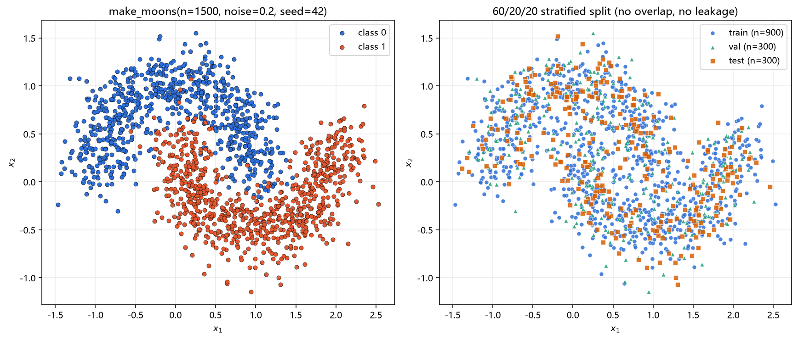

```python
X, y = make_moons(n_samples=1500, noise=0.2, random_state=seed)
X_train, X_hold, y_train, y_hold = train_test_split(X, y, test_size=0.4,
                                                    random_state=seed, stratify=y)
X_val, X_test, y_val, y_test = train_test_split(X_hold, y_hold, test_size=0.5,
                                                random_state=seed, stratify=y_hold)
scaler = StandardScaler().fit(X_train)          # 只用训练集拟合
```

| 子集 | 规模 | 职责 | 允许做的事 | 不要做的事 |
| --- | --- | --- | --- | --- |
| 训练集 train | 900 (450/450) | 更新权重：`zero_grad → backward → step` | 拟合参数、拟合标准化器 | —— |
| 验证集 val | 300 (150/150) | 模型选择：选超参、选 epoch、早停、看是否过拟合 | 反复看、反复调参 | 不用它更新梯度 |
| 测试集 test | 300 (150/150) | 最终一次的无偏性能估计 | 最后报告一次 | 不用它调任何东西 |

避免数据泄漏的四个做法：

1. 先切 test、再切 val，三个集合索引互不相交。
2. `stratify=y`，每个子集保持 1:1 类别比例。
3. `StandardScaler`的均值/方差只用训练集拟合，验证/测试集只`transform`。
4. test 只在最后评估时使用；一旦用它挑超参，它就变成第二个验证集。

## 2. MLP：训练、验证、测试、模型保存/加载

模型（`mlp_moons/models.py`，隐藏层数/宽度/激活/Dropout/BatchNorm 可配）：

```python
class MLP(nn.Module):
    def __init__(self, in_dim=2, hidden=64, n_hidden=2, out_dim=2,
                 activation="relu", dropout=0.0, batchnorm=False):
        layers, prev = [], in_dim
        for _ in range(n_hidden):
            layers.append(nn.Linear(prev, hidden))
            layers.append(ACTIVATIONS[activation]())
            prev = hidden
        layers.append(nn.Linear(prev, out_dim))     # 输出 logits
        self.net = nn.Sequential(*layers)
```

基线：2 → 64 → 64 → 2，ReLU，CrossEntropyLoss，Adam(lr=1e-2)，batch=64，200 epoch，4482 参数。

训练循环核心：

```python
logits = model(Xtr[idx])             # 前向
loss   = criterion(logits, ytr[idx]) # 交叉熵
optimizer.zero_grad()                # 清空上一轮梯度
loss.backward()                      # 反向传播，梯度累加到 .grad
optimizer.step()                     # 用梯度更新参数
```

基线结果（训练 1.96 s，9.8 ms/epoch）：

| 指标 | train | val | test |
| --- | --- | --- | --- |
| loss | 0.0668 | 0.0838 | 0.0769 |
| accuracy | 0.9711 | 0.9633 | **0.9833** |
| ROC-AUC | 0.9975 | 0.9960 | 0.9955 |

验证集最好成绩为第 158 epoch 的 0.9733。

保存/加载（`outputs/models/baseline.pt`）：保存`state_dict` + 配置 + 架构 + 指标；加载时按同一架构重建模型再`load_state_dict`，并调用`model.eval()`。脚本自动校验：重新加载后对 300 个测试样本的预测与原模型逐元素比较，**结果完全一致**。

## 3. loss、accuracy 曲线与二维决策边界

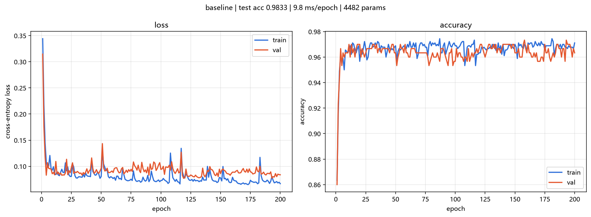

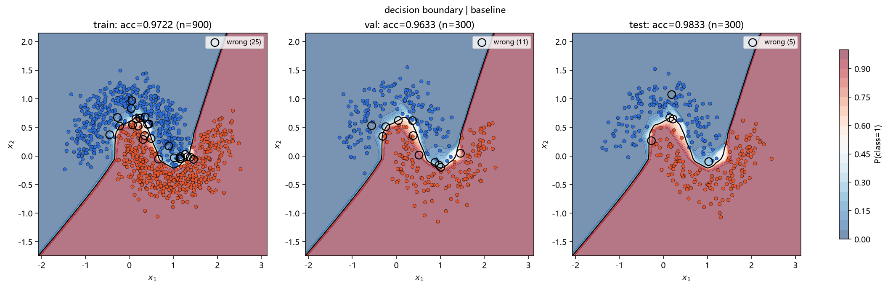

背景色为`P(class=1)`，黑线为 0.5 等值面；黑圈标出各子集的错误样本。

## 4. 对照实验

设置：同一份 6:2:2 划分、同一随机种子、200 epoch，每次只改动表中标注的那一个变量。

先用 5 个随机种子标定噪声：

| seed | 0 | 1 | 2 | 3 | 4 | 均值 ± 标准差 |
| --- | --- | --- | --- | --- | --- | --- |
| test acc | 0.9733 | 0.9833 | 0.9900 | 0.9833 | 0.9867 | **0.9833 ± 0.0062** |

即只换种子，测试准确率就有 0.62% 的标准差，以下小于 1% 的差异不做结论。

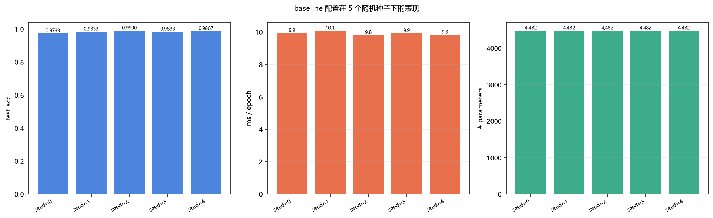

### 4.1 隐藏层宽度

| name | params | ms/epoch | train acc | val acc | test acc | gap |
| --- | --- | --- | --- | --- | --- | --- |
| w4 | 42 | 7.5 | 0.9656 | 0.9600 | 0.9800 | -0.0144 |
| w16 | 354 | 9.0 | 0.9678 | 0.9767 | **0.9900** | -0.0178 |
| w64 (基线) | 4482 | 10.3 | 0.9711 | 0.9633 | 0.9833 | -0.0111 |
| w256 | 67074 | 17.7 | 0.9644 | 0.9633 | 0.9767 | -0.0011 |

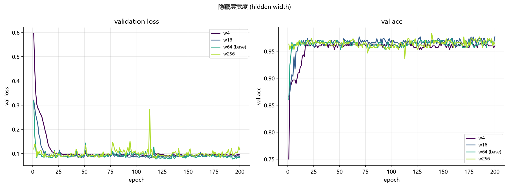
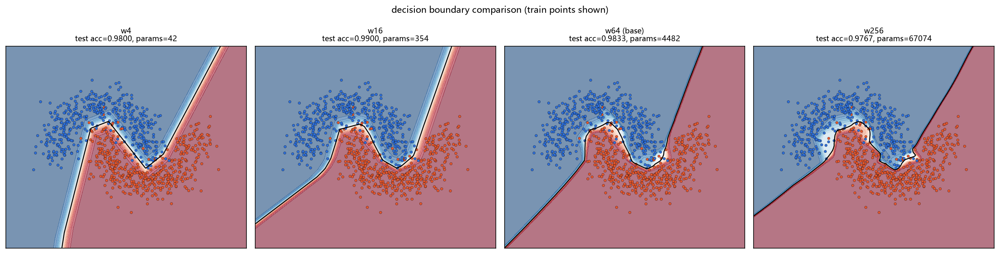
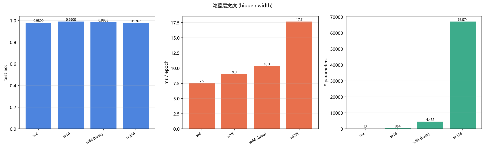

结果变化：参数从 42 增到 67074（1600 倍），耗时 +136%，测试准确率在 97.7%~99.0% 内波动，落在种子噪声内。

### 4.2 隐藏层数

| name | params | ms/epoch | train acc | val acc | test acc | gap |
| --- | --- | --- | --- | --- | --- | --- |
| d1 | 322 | 7.5 | 0.9722 | 0.9700 | 0.9800 | -0.0100 |
| d2 (基线) | 4482 | 10.2 | 0.9711 | 0.9633 | 0.9833 | -0.0111 |
| d4 | 12802 | 14.8 | 0.9756 | 0.9567 | 0.9800 | -0.0078 |

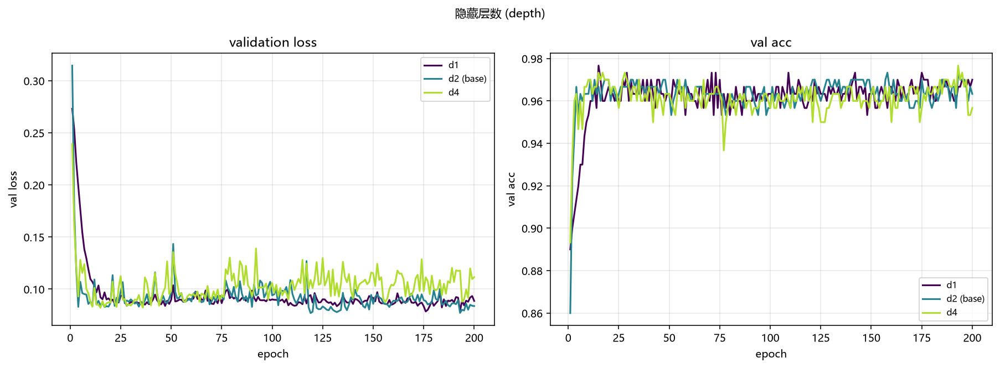
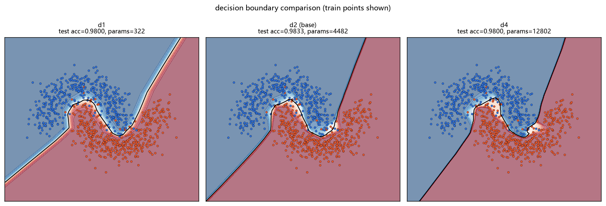
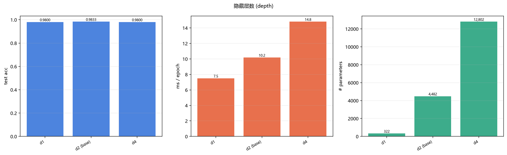

结果变化：1 层已经足够，加到 4 层参数 ×2.9、耗时 +45%，测试准确率无提升。

### 4.3 激活函数

| name (2 层) | ms/epoch | best val epoch | train acc | val acc | test acc |
| --- | --- | --- | --- | --- | --- |
| relu (基线) | 10.2 | 158 | 0.9711 | 0.9633 | 0.9833 |
| tanh | 8.8 | 32 | 0.9744 | 0.9533 | 0.9633 |
| gelu | 10.8 | 4 | 0.9700 | 0.9567 | 0.9833 |
| sigmoid | 8.5 | 73 | 0.9656 | 0.9700 | 0.9900 |

| name (4 层) | ms/epoch | best val epoch | train acc | val acc | test acc |
| --- | --- | --- | --- | --- | --- |
| d4+relu | 17.4 | 193 | 0.9756 | 0.9567 | 0.9800 |
| d4+tanh | 14.3 | 165 | 0.9633 | 0.9700 | 0.9867 |
| d4+gelu | 18.5 | 46 | 0.9722 | 0.9767 | 0.9800 |
| d4+sigmoid | 13.6 | 111 | 0.9678 | 0.9667 | 0.9867 |

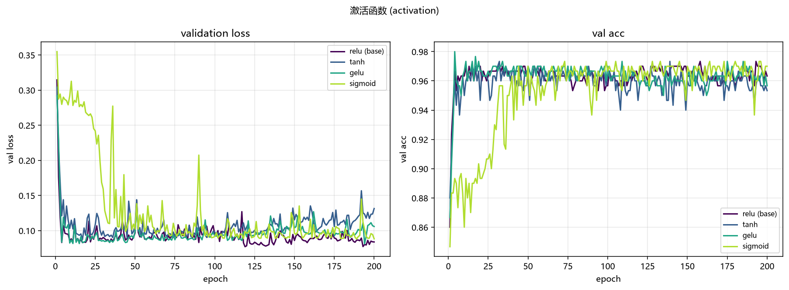
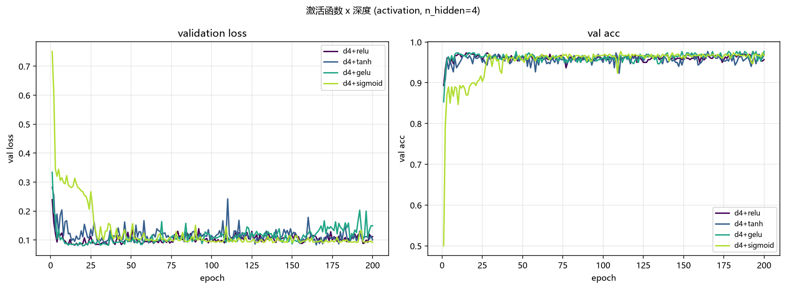
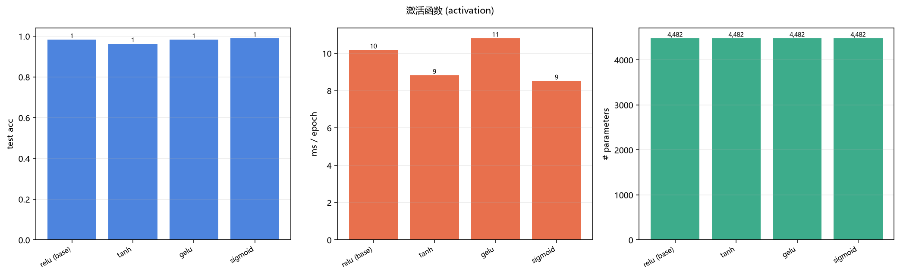
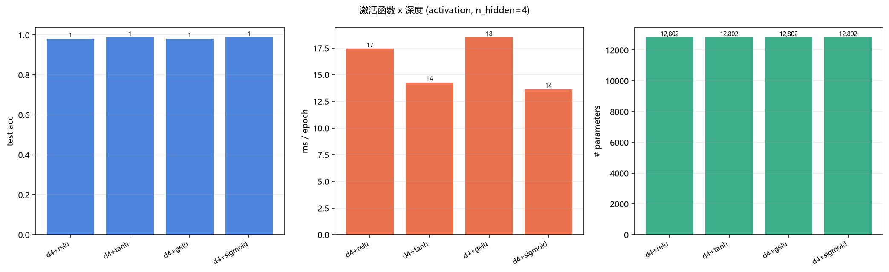

结果变化：最终测试准确率 96.3%~99.0%，差异都在种子噪声内；2 层时收敛速度差异明显（gelu 第 4 epoch / sigmoid 第 73 epoch 达到 best val），但换到 4 层后顺序改变（gelu 46、sigmoid 111、tanh 165、relu 193）。计算开销上`gelu`比`relu`约慢 6%。

### 4.4 学习率

| name | ms/epoch | final train acc | val acc | test acc | best val epoch |
| --- | --- | --- | --- | --- | --- |
| lr=1e-4 | 9.4 | 0.9633 | 0.9700 | 0.9800 | 194 |
| lr=1e-3 | 10.0 | 0.9722 | 0.9633 | 0.9833 | 23 |
| lr=1e-2 (基线) | 10.1 | 0.9711 | 0.9633 | 0.9833 | 158 |
| lr=1e-1 | 11.5 | **0.9422** | 0.9200 | **0.9400** | 60 |

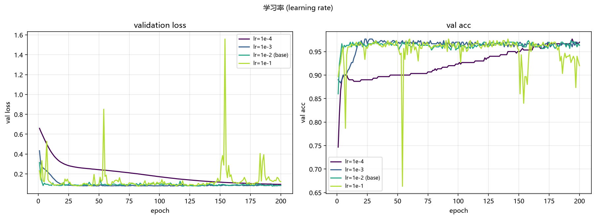
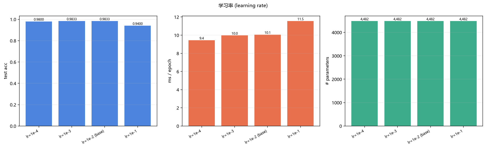

结果变化：`1e-4`在 200 epoch 时仍在爬升（best val 出现在第 194 epoch，欠拟合）；`1e-1`的 loss 曲线剧烈震荡，训练准确率四项最低（0.9422），测试掉到 0.9400。

### 4.5 优化器

| name | ms/epoch | train acc | val acc | test acc |
| --- | --- | --- | --- | --- |
| sgd | 5.4 | 0.9511 | 0.9400 | 0.9700 |
| sgd+momentum | 6.6 | 0.9711 | 0.9700 | 0.9833 |
| adam (基线) | 9.8 | 0.9711 | 0.9633 | 0.9833 |
| rmsprop | 7.9 | 0.9700 | 0.9533 | 0.9767 |

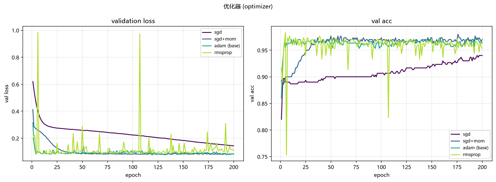
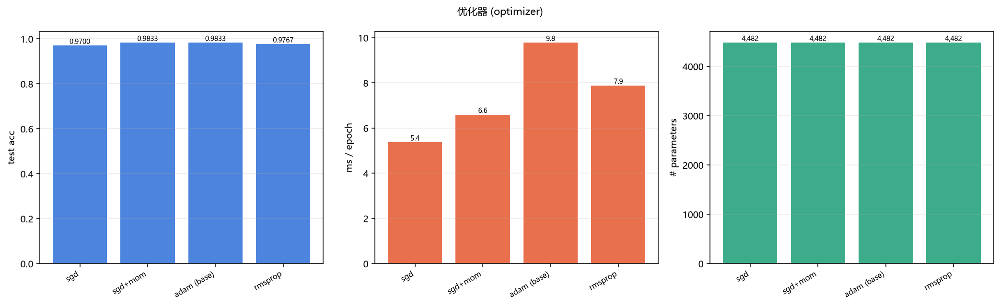

结果变化：裸 SGD 明显落后（0.9700），加动量后追平 Adam；Adam 单步最慢（维护一阶/二阶动量），但收敛需要的 epoch 更少。

### 4.6 batch size

| name | ms/epoch | train acc | val acc | test acc |
| --- | --- | --- | --- | --- |
| bs=16 | 37.7 | 0.9711 | 0.9567 | 0.9767 |
| bs=64 (基线) | 10.7 | 0.9711 | 0.9633 | 0.9833 |
| bs=256 | 2.8 | 0.9733 | 0.9600 | 0.9767 |
| bs=900 (全批量) | 1.0 | 0.9700 | 0.9700 | 0.9833 |

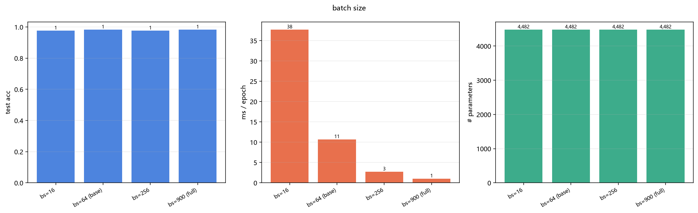
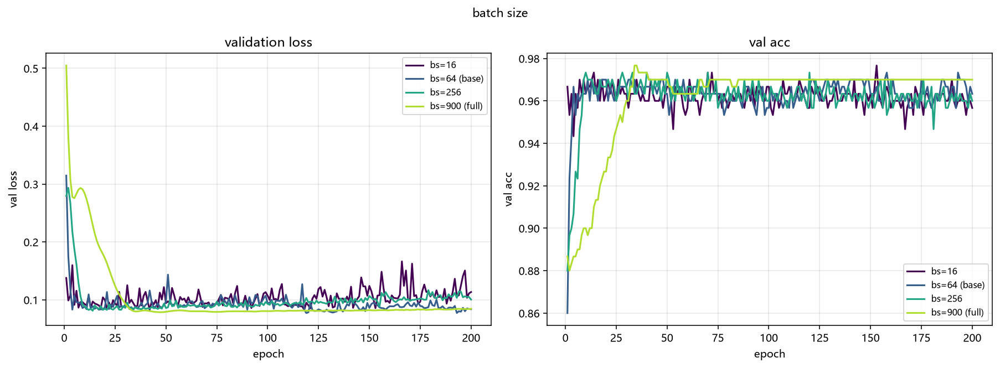

结果变化：准确率几乎不变，但速度差 36 倍（37.7 → 1.0 ms/epoch）。

### 4.7 数据噪声

| name | train acc | val acc | test acc |
| --- | --- | --- | --- |
| noise=0.00 | 1.0000 | 1.0000 | 1.0000 |
| noise=0.10 | 1.0000 | 0.9967 | 0.9967 |
| noise=0.20 (基线) | 0.9711 | 0.9633 | 0.9833 |
| noise=0.35 | 0.8956 | 0.8767 | 0.9033 |
| noise=0.50 | 0.8300 | 0.8200 | 0.8500 |

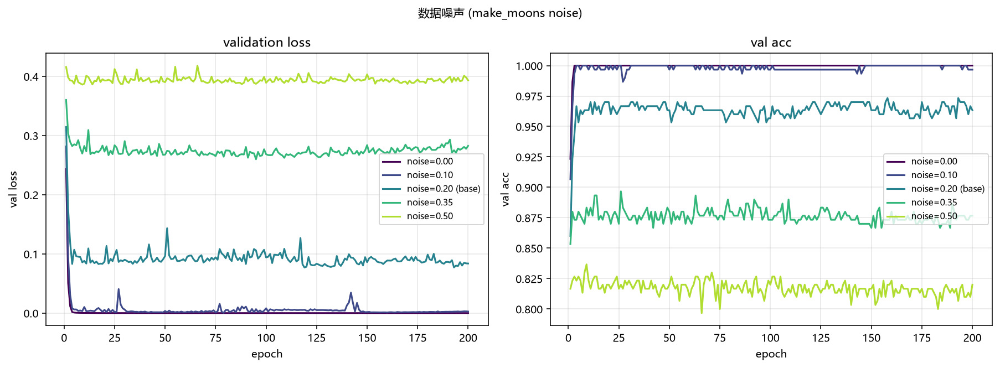
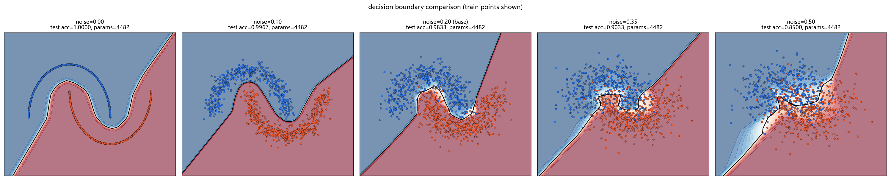
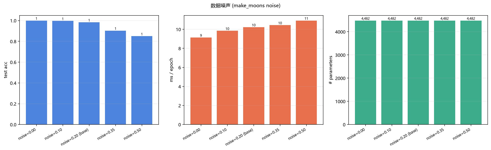

结果变化：准确率随噪声单调下降，100% → 85.0%。这一项的影响远大于网络结构。

### 4.8 速度与内存（独立子进程测量）

| 配置 | params | 参数体积 | ms/epoch | 训练 200 epoch | 峰值 RSS | 相对"仅导入 torch" |
| --- | --- | --- | --- | --- | --- | --- |
| 仅导入 torch | — | — | — | — | 296.6 MB | 0 |
| w16 | 354 | 0.0014 MB | 10.2 | 2.04 s | 370.3 MB | +73.7 MB |
| w64 (基线) | 4482 | 0.017 MB | 9.1 | 1.82 s | 371.6 MB | +74.9 MB |
| w256 | 67074 | 0.256 MB | 25.7 | 5.15 s | 377.4 MB | +80.8 MB |
| d1 | 322 | 0.0012 MB | 7.8 | 1.55 s | 371.3 MB | +74.7 MB |
| d4 | 12802 | 0.049 MB | 18.4 | 3.69 s | 371.6 MB | +75.0 MB |
| bs16 | 4482 | 0.017 MB | 36.0 | 7.19 s | 371.0 MB | +74.4 MB |
| bs256 | 4482 | 0.017 MB | 2.7 | 0.53 s | 371.7 MB | +75.1 MB |
| bs900 (全批量) | 4482 | 0.017 MB | 1.0 | 0.20 s | 372.4 MB | +75.8 MB |

显存：本机`torch.cuda.is_available() == False`，无法测量；代码中`engine.gpu_memory_mb()`已接`torch.cuda.max_memory_allocated()`，无 GPU 时返回 -1。
内存：torch 运行时本身占 296.6 MB，训练只额外增加 74~81 MB；参数量放大 15 倍也只多 5 MB。
时间：主要开销是 batch 数量带来的 Python 层循环次数，而非矩阵乘法。

## 5. 混淆矩阵与错误样本分析

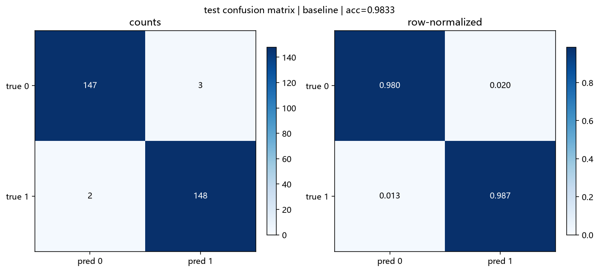

|  | pred 0 | pred 1 |
| --- | --- | --- |
| **true 0** | 147 | 3 |
| **true 1** | 2 | 148 |

FP=3、FN=2，类别 1 的 precision/recall = 0.980 / 0.987，macro-F1 = 0.9833。

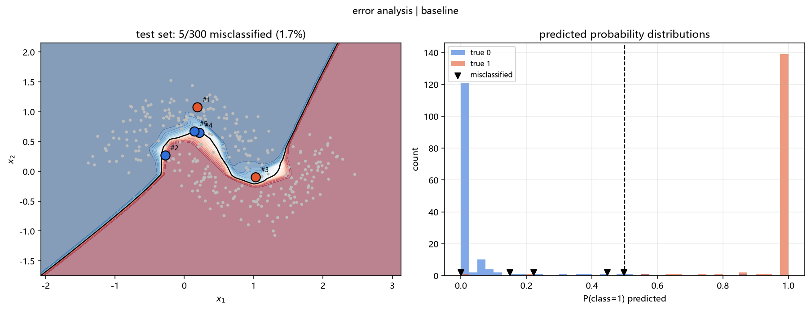

5 个错误测试样本（按\|logit 差\| 降序）：

| # | x1 | x2 | 真实 | 预测 | P(真实类) | P(预测类) | \|logit 差\| | 到边界距离 |
| --- | --- | --- | --- | --- | --- | --- | --- | --- |
| 1 | 0.191 | 1.072 | 1 | 0 | 0.00002 | 1.000 | 10.99 | 0.500 |
| 2 | -0.271 | 0.266 | 0 | 1 | 0.149 | 0.851 | 1.75 | 0.351 |
| 3 | 1.031 | -0.100 | 1 | 0 | 0.222 | 0.778 | 1.25 | 0.278 |
| 4 | 0.220 | 0.645 | 0 | 1 | 0.447 | 0.553 | 0.21 | 0.053 |
| 5 | 0.148 | 0.669 | 0 | 1 | 0.497 | 0.503 | 0.011 | 0.003 |

- #1 坐标 (0.19, 1.07) 落在上方月亮的弧线上，模型给出 P(1)=2e-5。它是`noise=0.2`把标签推进对方领地的样本，属于数据本身的贝叶斯误差。
- #4、#5 的 P(1) 为 0.553 / 0.503，到边界距离 0.053 / 0.003，属于边界模糊样本，换种子就会翻转。
- 前者说明该回去查数据标注，后者说明模型已接近该数据集的性能上限。

## 6. 趁热打铁

### Q1 选了什么激活函数，为什么？

ReLU。x>0 时导数恒为 1，不会像 sigmoid/tanh 那样两端饱和，梯度更稳定；计算最便宜（比 gelu 快约 6%），且约一半神经元输出为 0。4.3 节的深层对比中 tanh/sigmoid 也能收敛，但最终准确率差异都在种子噪声内，真正有差别的是收敛速度与计算开销。

### Q2 选了什么损失函数？三分类呢？

CrossEntropyLoss。它是分类的最大似然估计，PyTorch 内部为`LogSoftmax + NLLLoss`，数值稳定，且与 softmax 组合后对 logits 的梯度就是`p - onehot`。标签用整数，不需要 one-hot。

三分类：损失函数不变，把输出层`nn.Linear(64, 2)`改为`nn.Linear(64, 3)`即可（标签仍是 0/1/2）；需要同时改的是数据生成（`make_blobs(centers=3)`）、指标（AUC 换成 macro/OVR）和 3×3 混淆矩阵。只有多标签问题才换成`BCEWithLogitsLoss`。

### Q3 zero_grad / backward / step 分别做什么？不清空梯度会怎样？

| 调用 | 作用 | 不写的后果 |
| --- | --- | --- |
| `optimizer.zero_grad()` | 把`param.grad`清零 | 梯度累加 |
| `loss.backward()` | 反向传播，把 ∂loss/∂param **累加**到`.grad` | 没有梯度，参数不更新 |
| `optimizer.step()` | 按优化器规则用`.grad`更新参数 | 参数永远不变 |

`.grad`是累加语义，`backward()`不会自动清零。实测删掉`zero_grad()`的结果：

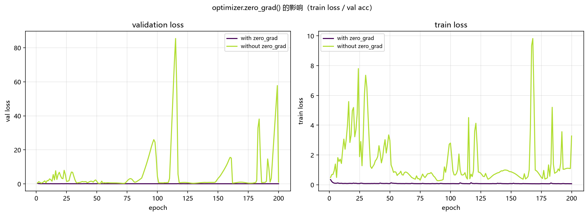

| 配置 | final train loss | train acc | best val acc | test acc | 混淆矩阵 |
| --- | --- | --- | --- | --- | --- |
| 正常 zero_grad | 0.0668 | 0.9711 | 0.9733 | 0.9833 | TN=147, FP=3, FN=2, TP=148 |
| 去掉 zero_grad | 3.2741 | 0.8167 | 0.9300@8 | 0.8333 | TN=150, FP=0, FN=50, TP=100 |

梯度不断累积，等效学习率随 step 数放大，loss 涨到正常值的 49 倍，模型退化为几乎全判 0 类（少数类 recall 0.667）。

（梯度累积训练大 batch 时就是故意不清零：多次 backward 后 step 一次再清零。）

### Q4 更深更宽一定更好吗？

不一定。4.1 节宽度 42 → 67074 参数，测试准确率 0.9800 → 0.9767；4.2 节隐藏层 1 → 4，参数 ×2.9，测试准确率 0.9800 → 0.9800。

| 情况 | 现象 | 例子 |
| --- | --- | --- |
| 过于简单/欠拟合 | 训练与验证 loss 都降不下去 | `w4`（42 参数）；`lr=1e-4`（模型够大但没训够） |
| 过于复杂/过拟合 | 训练接近满分，验证变差 | 132866 参数拟合 30 个样本，验证 loss 16.74，测试 0.6967 |

### Q5 学习率过大或过小？loss 曲线能看出什么？

| | 现象 | loss 曲线 | 本实验 |
| --- | --- | --- | --- |
| 太小 | 收敛极慢，结束还没训完 | 平滑下降但斜率一直很小 | lr=1e-4，best val 在第 194 epoch |
| 合适 | 快速下降后进入平台 | 前 10~30 epoch 快速下降后趋平 | lr=1e-2，测试 0.9833 |
| 太大 | 最优点附近震荡，效果反而变差 | 锯齿状抖动、出现尖峰、不再单调下降 | lr=1e-1，训练 0.9422、测试 0.9400 |

注意区分：loss 抖动也可能来自小 batch 的梯度噪声（bs=16 比 bs=900 抖，但准确率不差）；验证 loss 上升而训练 loss 下降是过拟合，不是学习率过大。

### Q6 类别不均衡会怎样？

构造 10:1 不均衡数据（train 1200:133，test 400:45）：

| 方案 | accuracy | balanced acc | 少数类 recall | 少数类 precision | macro-F1 | FN | FP |
| --- | --- | --- | --- | --- | --- | --- | --- |
| 普通交叉熵 | **0.9843** | 0.9419 | 0.8889 | 0.9524 | 0.9554 | 5 | 2 |
| 类别加权`weight=balanced` | 0.9663 | **0.9615** | **0.9556** | 0.7679 | 0.9162 | 2 | 13 |

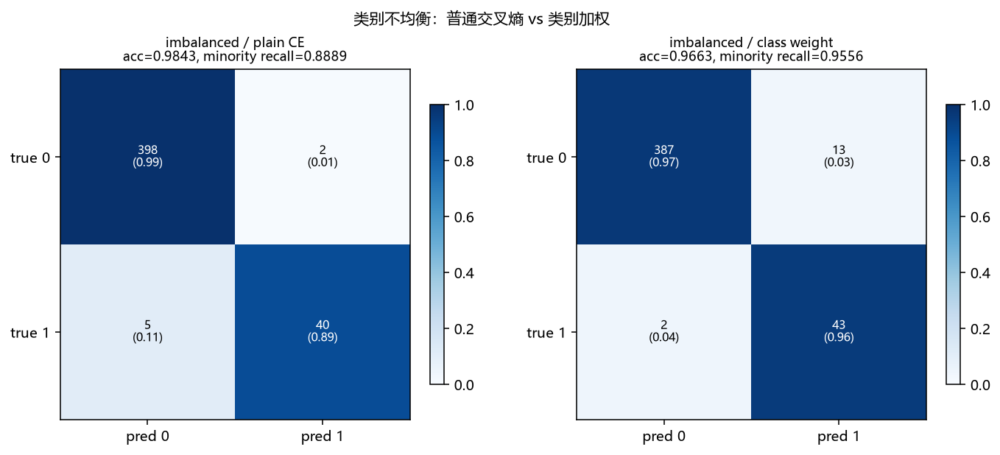
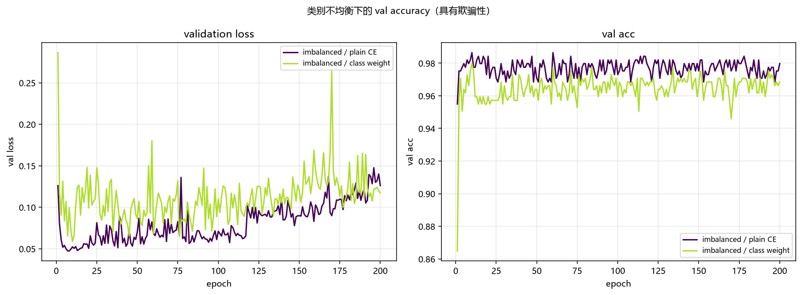

原因：交叉熵按样本平均，多数类主导梯度；全部判为多数类即可拿到 400/445 = 89.9% 的准确率。
说明：accuracy 在不均衡数据上会失效，应看少数类 recall/F1、balanced accuracy、PR-AUC 并打印混淆矩阵；加权把边界推向多数类，用更多误报（FP 2→13）换更少漏检（FN 5→2）。

### Q7 想让它过拟合要怎么做？怎么判断？

配置：训练集缩到 30 个样本，模型放大到 256×3（132866 参数），训练 2000 epoch，无正则；第二个实验再翻转 20% 训练标签。

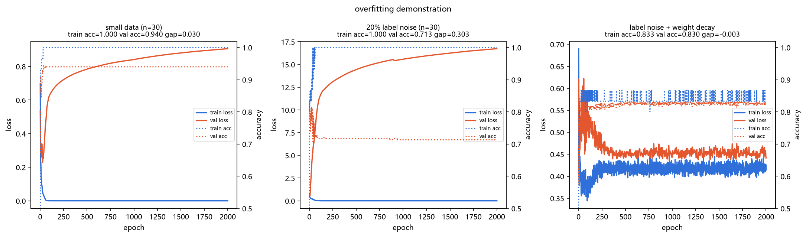
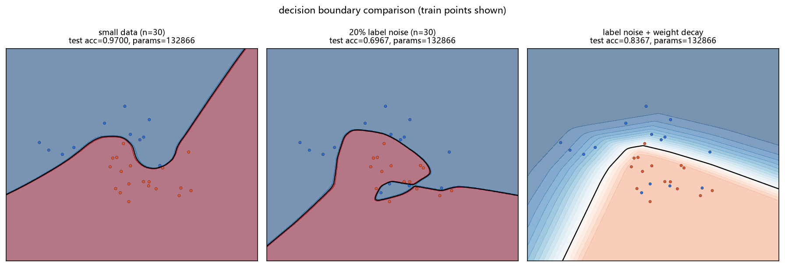

| 实验 | train acc | val acc | val loss | test acc | gap |
| --- | --- | --- | --- | --- | --- |
| 30 样本，无噪声 | **1.0000** | 0.9400 | 0.9056 | 0.9700 | +0.0300 |
| 30 样本 + 20% 标签噪声 | **1.0000** | 0.7133 | **16.7390** | 0.6967 | **+0.3033** |
| 同上 + weight decay 5e-2 + dropout 0.2 | 0.8333 | 0.8300 | 0.4416 | 0.8367 | -0.0033 |

做法：减少训练样本、放大模型、增加训练轮数（不早停）、注入标签噪声、关闭所有正则。

判断依据：① 训练准确率接近 100% 而验证明显更低（本次差 30.3%）；② 训练 loss 持续下降、验证 loss 掉头上升，验证 loss 最低点即早停位置；③ 决策边界出现孤立碎块；④ 训练 loss 接近 0 而验证 loss 停在 16.74。

加上正则后训练准确率降到 0.8333，但验证 loss 降到 0.4416、测试升到 0.8367、gap 归零。
